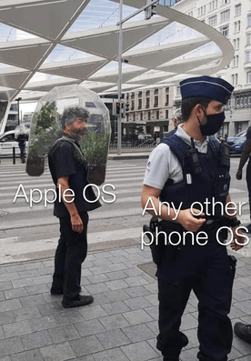
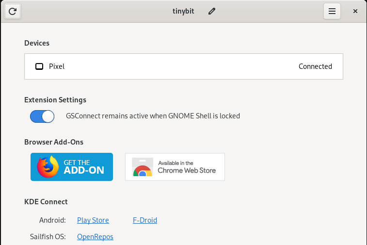
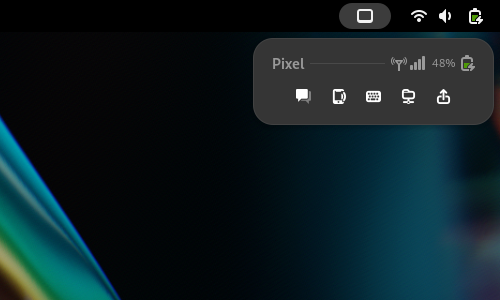
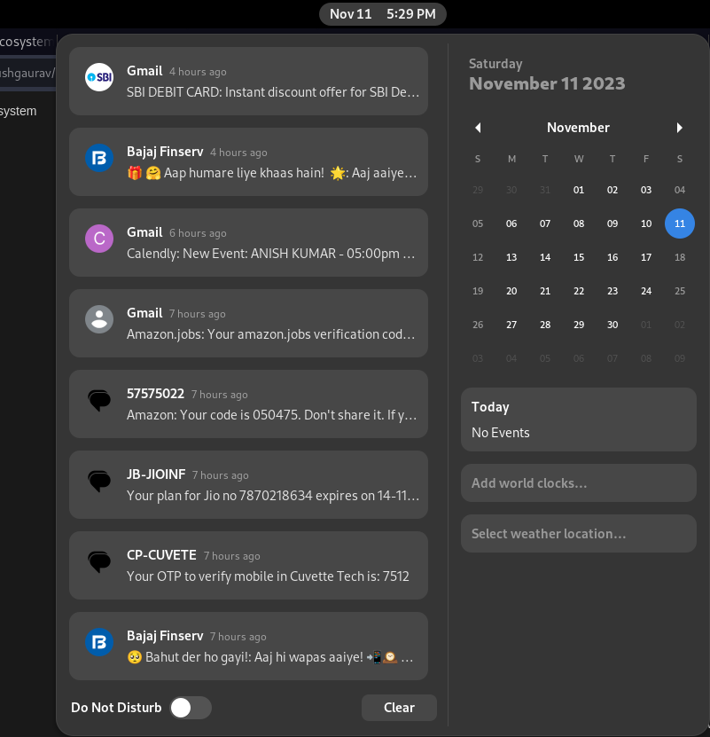
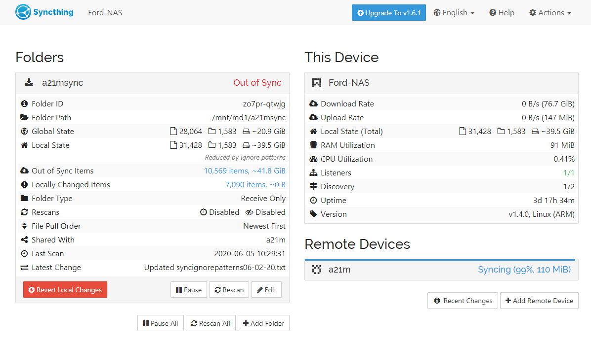

The term “ecosystem” refers to the interconnected network of hardware, apps, services and other user experiences that are designed to work seamlessly together within a brand’s products.

A good example of a ecosystem is Apple’s. Their devices works flawlessly together. People use this a way to justify their purchase of apple products and I get that, the ecosystem is great and it works flawlessly between apple devices, it integrates online services such as iCloud, the App Store, Apple Music, iMessage, FaceTime, and more and you can easily share content and access your data from any apple device. 

But what if you don’t want to get into the walled garden that is apple’s ecosystem. If you are a linux user like me and you want to replicate the same ecosystem you are in luck, we are going to look how we could do that.

One feature about our ecosystem is that this is not limited to devices of a particular manufacturer unlike apple.



## The Apps

- KDE Connect - For seamless integration between your phone and Linux system.
- Syncthing - Sync files and folders between your devices.
- tmux and SSH - Access your devices from each other.

## KDE Connect

For most of the people who want to integrate their phone to their linux system, [KDE Connect](https://kdeconnect.kde.org/) is the solution. Don’t get fooled by the name though, it also works on other desktop environments like Gnome. If you are using Gnome, install [GSConnect](https://extensions.gnome.org/extension/1319/gsconnect/) instead of KDE connect and follow through, everything is almost exactly same.

To start using KDE Connect you need to first need to [download](https://kdeconnect.kde.org/download.html) KDE Connect on your linux desktop, KDE Connect is available for all major linux distributions and desktop environments. Howerver, if you are using Gnome, you might want to install the [GSConnect extension](https://extensions.gnome.org/extension/1319/gsconnect/) from Gnome Extensions, it is basically a fork of KDE Connect build on top of KDE Connect protocol.

Next thing you need to install is [KDE Connect](https://play.google.com/store/apps/details?id=org.kde.kdeconnect_tp&hl=en_IN) on your andriod device from the Play Store. 



Most of the work is done now. If you are connected on the same WiFi network as your linux desktop you will see your desktop on your KDE Connect app on your phone. Just connect to it.

### What can you do with KDE Connect?

You can do pretty much all the basic things that you expect your Linux ecosystem to do. You can share files, control phones, receive notifications, receive calls and reply to messages, control media, share clipboard, and much more. The list is very vast. 



KDE Connect (GSConnect) for my Pixel phone on my desktop.

If you are not already using KDE Connect, your mind will be blown if you see what experience it delivers. KDE Connect is a game changer.



You will receive all the notifications in the notification panel of your DE.

## Syncthing: Sync files automatically

[Syncthing](https://syncthing.net/) is a continuous file syncing utility that allows to sync files and directories between different devices. It’s opensource and uses a opensource protocol called [Block Exchange Protocol](https://docs.syncthing.net/specs/bep-v1.html#bep-v1) to sync units of files called “blocks” between devices. 

It works flawlessly between devices even if they are on different operating systems.  You can set a folder on your mobile device to automatically sync to your desktop.



To use syncthing you need to install it to your host machine. You can download it from the syncthing’s [download page](https://syncthing.net/downloads/). it is also available on all major distro’s package manager. Its accessible by a web gui. You will also need to install syncthing on every other device that you want to sync. The setup process is very simple and straightforward. It basically involves adding remote devices which you want to sync.

### Update on Syncthing andriod app

Two months back, the creator for the andriod app of syncthing, imsodin announced that, he will no longer maintain the andriod app. He announced it on the [forums](https://forum.syncthing.net/t/discontinuing-syncthing-android/23002). After this announcement many forked the andriod app and started maintaining themselves. One such fork you could use is Catfriend1’s [syncthing-andriod](https://github.com/Catfriend1/syncthing-android).

## tmux and SSH

tmux is short for terminal multiplexer. It allows you to run multiple terminal sessions within a single terminal window. Each tmux session can run multiple shells inside itself, you could switch between multiple shells and also map useful shortcuts and themes to spice up your workflow. 

You could also connect to tmux sessions running on remote systems. Say for example that you were working on your desktop computer and now you want to switch to your laptop, you could easily SSH to your desktop from your laptop and then attach to the tmux session running on your desktop. It’s even better when you use neovim as a code editor, it will make switching between devices a breeze.

Now, if you are like me you must have some love and hate relationship with SSH. If you have multiple devices and servers. It will become troublesome to remember the username and hostnames or IP addresses for each particular device. Hopefully, there is a way to save you from all this trouble. In your .ssh folder (~/.ssh), you could make a config file, where you could type alias for each device and if you use private keys for authentication, you could specify them here.

Here is a sample config file:

```jsx
Host laptop
        Hostname 10.1.1.32
        User tushgaurav
        IdentityFile ~/.ssh/id_rsa.pub
        
Host mobile_phone
        Hostname 10.1.1.21
        User tushgaurav
        IdentityFile ~/.ssh/id_rsa.pub
        
Host server
        Hostname http://ec2-54-123-45-678.compute-1.amazonaws.com
        User tushgaurav
        IdentityFile ~/.ssh/id_rsa.pub
```

In this config file we have three separate blocks for three hosts. Each host has a alias such as laptop, mobile_phone and server. I have also provided other information such as the actual hostname, user and the identityfile as I am using keys for authentication, you don’t need to add this if you are using passwords.

After saving this file to `~/.ssh/config`, I could just type `ssh laptop` to SSH to my laptop. Easy and simple.

Spend enough time on your ecosystem and you will have something that works best for you and that my friends is the perfect ecosystem, far superior than what any company can offer. You would know it’s ins and outs. Happy tweaking.